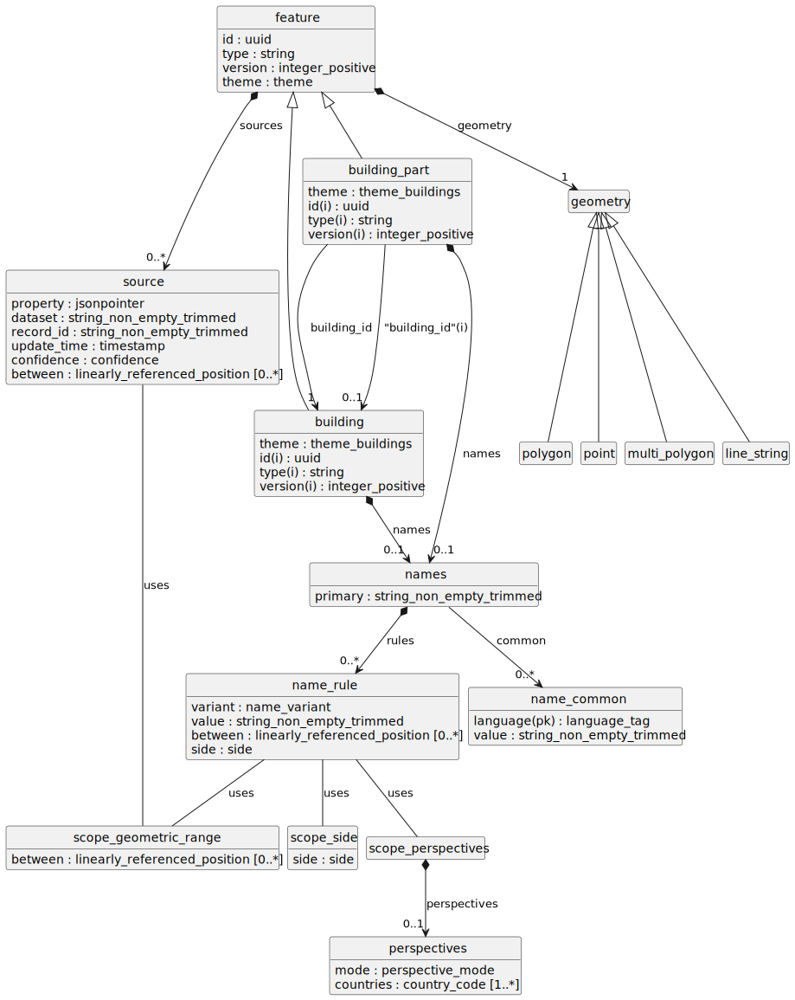

Proof of concept for migrating the [Overture Maps Schema](https://github.com/OvertureMaps/schema)
to [LinkML](https://linkml.io/).

# UML diagram

Here is a PlantUML rendering of the progress to date using `$ linkml generate plantuml schema/schema.yaml`...

# Next steps

1. Model sources. This is a good opportunity to try using LinkML's built-in
   JSON Pointer type.
2. Possibilities and limitations for geometry:
    - Can we limit geometry types available to specific feature types?
    - Is there some kind of reasonable "default" representation of geometry?
    - Does LinkML natively support a binary type such that the default
      representation could be binary? Should it support that?
    - Is it feasible to emulate a binary type by creating an "array of bytes"
      type?
    - Do annotations help with anything?
3. Specific generator mods:
    - Can a Parquet schema generator be created? (Maybe the output dialects
      are PySpark types, Scala types, or a JSON format?)
    - Can a GeoJSON-flavored JSON Schema generated be created?
    - Can any of the existing language mapping generators be enhanced with
         1. GeoJSON serde support?
         2. Spark dataframe serde support?

# Issues

## Bugs

- [JSON schema generator wrongly selects `string` for all indirect types](https://github.com/linkml/linkml/issues/2666)

## Enhancement Requests

- [Native geometry type](https://github.com/linkml/linkml/issues/2667)
